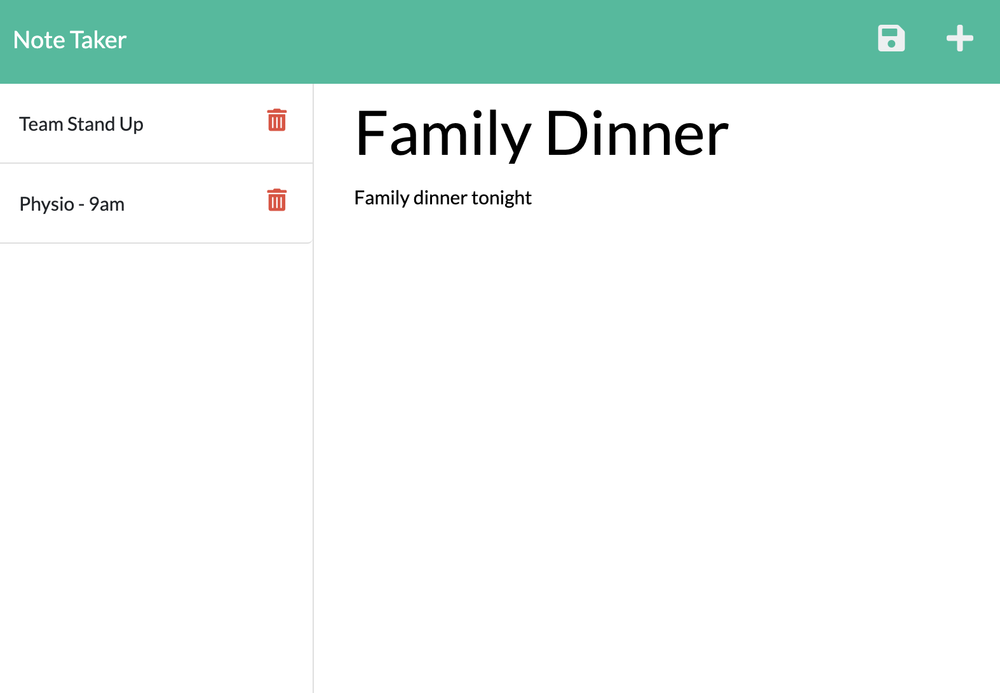
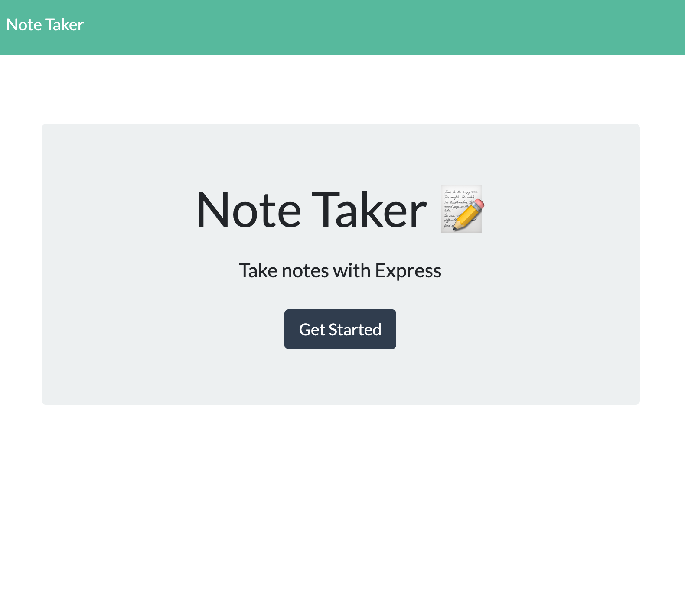

# Note Taker

## Description 
The purpose of this app is to generate a quick and easier way to take notes online. This app allows you to add, modify and delete notes.

Heroku link: https://note-taker-sbuntz.herokuapp.com/notes

 
  

## Table of Contents
* [Installation](#installation)
* [Usage](#usage)
* [License](#license)
* [Questions](#questions)

## Installation 
To install the app the user will need to clone this repository from GitHub and run npm install to download the dependency packages. 

## Usage 
To run the app use npm start or click through to the heroku deployment

## License 
This project is license under MIT

## Questions
If you have any questions about this projects, please contact me directly at stbuntz@gmail.com. You can view more of my projects at https://github.com/sbuntz.